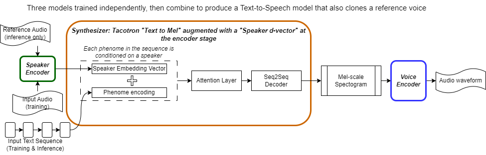

# Fine tuning a Speech cloning model with a "Gold Standard" 🥇 Speech Dataset

This repo contains a workflow to process Speech & Text data to give a Gold Standard training dataset for [the task of Speech Cloning / Speech Mimicry](https://indianexpress.com/article/technology/artificial-intelligence/ai-voice-cloning-rise-protect-yourself-8910268/#:~:text=AI%20voice%20cloning%2C%20also%20known,vocal%20characteristics%20of%20the%20individual.). I've used the workflow to fine-tune a Speech Cloning system using [RTVC](https://github.com/CorentinJ/Real-Time-Voice-Cloning) (an implementation of [Transfer Learning from Speaker Verification to Multispeaker Text-To-Speech Synthesis (SV2TTS)](https://arxiv.org/pdf/1806.04558.pdf))
- [Fine tuning a Speech cloning model with a "Gold Standard" 🥇 Speech Dataset](#fine-tuning-a-speech-cloning-model-with-a-gold-standard--speech-dataset)
  - [What is 'Gold Standard' Speech data?](#what-is-gold-standard-speech-data)
  - [Fine tuning a pre-trained Voice-Cloning model](#fine-tuning-a-pre-trained-voice-cloning-model)
    - [Superior performance on a specific task, with minimal additional training time.](#superior-performance-on-a-specific-task-with-minimal-additional-training-time)
  - [The results](#the-results)
- [Installation](#installation)
  - [Command Line tools for dat preprocessing - this repo](#command-line-tools-for-dat-preprocessing---this-repo)
  - [Diarization tool: pyannote-audio](#diarization-tool-pyannote-audio)
  - [Speech Cloning repo](#speech-cloning-repo)

---

With high quality data, the model fine tuning process gives a higher quality synthetic speech output, and shorten training time.

 - 🛠️ [The Data Processing Workflow](workflow.md)
 - 💾 [Scripts to manipulate the interim data.](./scripts)
 - 📊 [Notebooks to visualise & diagnose anomalous data.](./notebooks)

## What is 'Gold Standard' Speech data?

Accurately transcribed words by time & speaker name, and a recording high quality. These are hard to come by because labelling audio with text is a costly human process. [Whisper AI uses combination of Gold standard, then later Silver standard to help its generalisation performance](https://www.graphcore.ai/posts/how-to-use-openais-whisper-for-speech-recognition)

***But why bother? You could skip the whole pre-processing stage - there are open source tools available to transcribe audio.***
- The tools are definitely faster, but not as accurate. Watch a youtube with subtitles to see the difference.
- *"Quality in, Quality out"*. Enevitably there are losses each time you try to represent a dataset with a model. Using a model (speeech-to-text) to synthesize training data compounds this effect.

The datasets I used were from [BBC podcasts](https://www.bbc.co.uk/programmes/b04v380z). The BBC has been in the business of high quality audio for over 100 years. Their sound engineers are highly experienced, and the BBC have always provided  great accesibility - so they've great experience making transcriptions.

## Fine tuning a pre-trained Voice-Cloning model

The system I used is made from 3 pre-trained models:
1. Speaker Encoder ([GE2E](https://arxiv.org/pdf/1710.10467.pdf), green) - Encodes audio waveforms to a "Speech d-Vector" embedding, by maximising the cosine similarity between samples of the same speaker.
2. Voice Synthesizer ([Tacotron](https://arxiv.org/pdf/1703.10135.pdf), orange, 30.87M parameters) - A Generative, Attentional, sequence to sequence model converts Text to Mel-spectograms.
3. Voice Encoder ([WaveRNN](https://arxiv.org/pdf/1802.08435.pdf), blue, 4.481M parameters) - Sequence to Sequence neural network converts Audio from [Mel-spectograms](https://ketanhdoshi.github.io/Audio-Mel/#:~:text=A%20Mel%20Spectrogram%20makes%20two,of%20Amplitude%20to%20indicate%20colors.)



They're assembled into a single model that allows one-shot training ("Cloning") of a reference voice. ([described in this paper](https://arxiv.org/pdf/1806.04558.pdf), [Implementation used](https://github.com/CorentinJ/Real-Time-Voice-Cloning))

The Speaker Encoder must be trained first, because the embeddings it creates are input data associated with the waveform-text pairs the Voice Synthesizer is trained on.

### Superior performance on a specific task, with minimal additional training time.

The system is designed to imitate any speaker's voice. It can do this because of the hundreds of speakers it's pre-trained on, and the architecture of the Synthesizer + Speaker Encoder combo.

A gold standard dataset, processed with the below workflow, is used to run a a relatively small amount more iterations on data from only one speaker. The system doesn't loose its ability to clone *any* new speaker, but greatly improves the quality of cloned voice for the one speaker in the fine tuning dataset.

## The results

The entire model training would take around 15 days for just the Synthesizer. Fine tuning on 22 minutes of single-speaker audio data produces the below synthesised voice. Only the Synthesizer needs fine tuning, though the Vocoder could also be fine tuned afterwards.

Ground truth audio;

https://github.com/samoliverschumacher/voice-cloning-workflow/assets/80297960/d27b67f8-9457-4c24-aaa2-43955830a17d

Transcript;
```
BOOST|BRAIN|POWER|FIRST|HE|TRIED|SMART|PILLS|THEN|HE|MOVED|ON|TO|ELECTRICAL|BRAIN|STIMULATION|FOR|COGNITIVE|ENHANCEMENT
```

Pre-trained model, trained for 295,000 iterations. Conditioned with audio from the same speaker;

https://github.com/samoliverschumacher/voice-cloning-workflow/assets/80297960/9d0fbda7-02ba-4e2e-b92c-550a4c3e3636

> 🔉 *At least the pre-trained model has imitated a voice that is female! But it's not fooling anyone...*

Fine-tuned model, trained for a further 19,000 iterations. Conditioned with audio from the same speaker;


https://github.com/samoliverschumacher/voice-cloning-workflow/assets/80297960/0bb21378-6701-421b-9430-d19c0a8e8e57


> 🔉 *In contrast to the pre-trained model, the fine-tuned model has done an amazing job - with only about 36 hours training on a NVIDIA GeForce RTX 3050 Ti Laptop GPU!!*
> 
> 🔉 *Super interesting nuance here: The second half of the audio is spoken more quickly and flows naturally, the first half is 'robotic' and words are spoken independent of eachother.*
> 
> 🔉 *Listening to the original audio, there are moments when the speaker audibly breathes in, and the sound engineer has not cropped this out. In the fine-tuned model an audible breath occurs before "`THEN HE`".* 
> 
> 🔉*I wonder whether this is a cue for recalling (memorization) this exact training example? Or, if not simply overfitting - perhaps it's something more impressive - the RNN has learnt a deep breath in preceeds a segment of more rapid speech?*


# Installation

Set up a conda environment to install the below - there are tools required outside of python packages, such as CUDA for GPU support for Pytorch.


## Command Line tools for dat preprocessing - this repo
```
pip install -f requirements.txt
```

And follow instructions to [install Pytorch Audio](https://pytorch.org/audio/main/installation.html), and [Pytorch](https://pytorch.org/)

## Diarization tool: pyannote-audio

```bash
pip install -qq https://github.com/pyannote/pyannote-audio/archive/refs/heads/develop.zip
``` 

> Note: A few of the pacakges required in this repo, come from the dependencies of pyannote.audio

[Then, follow the other installation steps](https://github.com/pyannote/pyannote-audio/tree/develop#tldr)

## Speech Cloning repo
[Real Time Voice Cloning](https://github.com/CorentinJ/Real-Time-Voice-Cloning/tree/master#1-install-requirements), is a submodule of this Repo. Follow its install steps. It's scripts do the model training / fine tuning.
