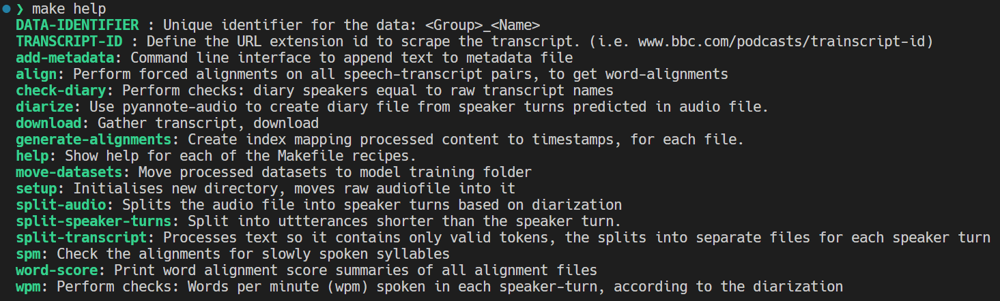
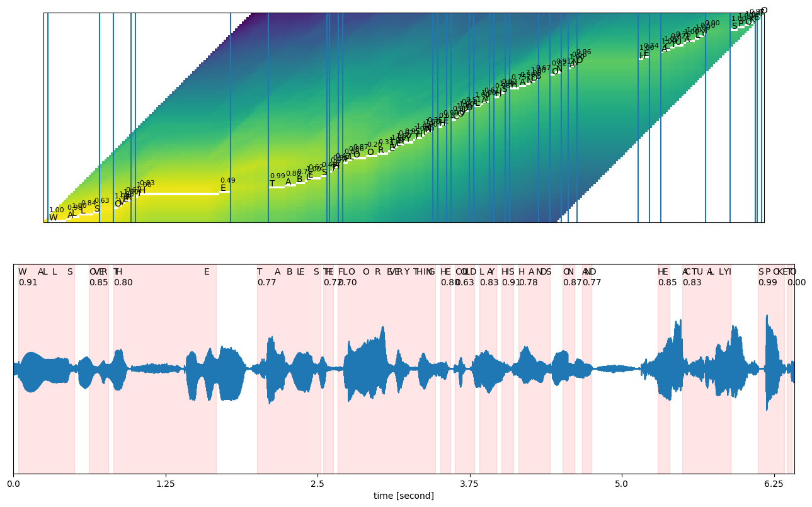
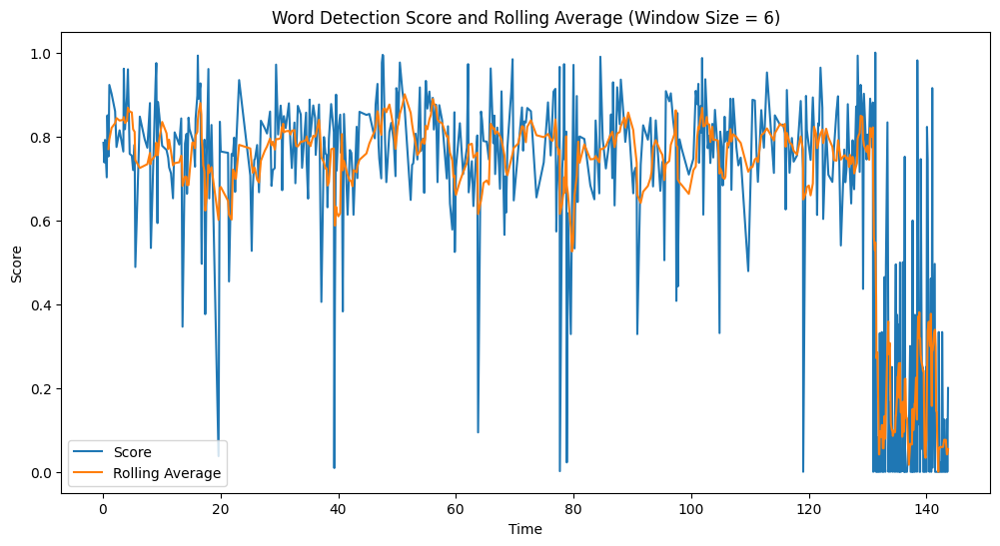

**Table of Contents**
- [Data Processing Workflow](#data-processing-workflow)
  - [1: Obtain the transcription](#1-obtain-the-transcription)
  - [2: Create a diarization of speaker turns. i.e. `start, stop, speaker`.](#2-create-a-diarization-of-speaker-turns-ie-start-stop-speaker)
    - [Analysis:](#analysis)
  - [3: Check diarization: diary has speakers in same order as transcript.](#3-check-diarization-diary-has-speakers-in-same-order-as-transcript)
  - [4: Split and clean the transcript into separate single-speaker transcript files;](#4-split-and-clean-the-transcript-into-separate-single-speaker-transcript-files)
  - [5: Split audio file into separate single-speaker audio files, for each speaker turn.](#5-split-audio-file-into-separate-single-speaker-audio-files-for-each-speaker-turn)
  - [6: Check: That the words per minute, for each single speaker audio \& transcript pair, are reasonable.](#6-check-that-the-words-per-minute-for-each-single-speaker-audio--transcript-pair-are-reasonable)
  - [7: Align words in transcripts to timestamps for their audio file.](#7-align-words-in-transcripts-to-timestamps-for-their-audio-file)
  - [8: Check: syllables per minute in each aligned word](#8-check-syllables-per-minute-in-each-aligned-word)
  - [9: Check: for files with low word alignment scores.](#9-check-for-files-with-low-word-alignment-scores)
  - [10: Split speaker files into smaller utterances that adhere to the model training data requirements](#10-split-speaker-files-into-smaller-utterances-that-adhere-to-the-model-training-data-requirements)
    - [Final dataset quality checks](#final-dataset-quality-checks)
  - [11: create alignment file](#11-create-alignment-file)
- [Fine-tune the Speech synthesizer model](#fine-tune-the-speech-synthesizer-model)

# Data Processing Workflow

*Creating a Gold-Standard speech synthesis dataset.*

This workflow is centered around a [`Makefile`](Makefile) that orchestrates a number of [python command line tools](scripts). The `Makefile` maps the process for processing a single raw audio & transcript pair.



The process isn't perfect, so checks and analyses have to be run on stages of the process along the way as detailed below.

## 0: Initialise directory structure

Each raw data item is a long form conversation between more than one person (podcast, interview, monologue etc.). So, the high-level splits into speakers, and it progressively splits the data until it matches the [max length](https://github.com/CorentinJ/Real-Time-Voice-Cloning/blob/77c0bd169d8158ed1cdb180cda73c24d3cacd778/synthesizer/hparams.py#L66) & [min length](https://github.com/CorentinJ/Real-Time-Voice-Cloning/blob/77c0bd169d8158ed1cdb180cda73c24d3cacd778/synthesizer/hparams.py#L88) requirements for the model.

```bash
data-name/
├── audio.wav
├── transcript.txt
├── metadata.json
├── diary.txt
├── diary-overrides.csv
├── transcript.alignment.txt
├── speaker-A/
│    ├── turn-1.processed.txt    # < -- A single "turn" in a conversation.
│    ├── turn-1.wav
│    ├── turn-1-alignments.json
│    ├── ...
│    ├── speaker-A-turn-section/   # < -- Longer speaker turns need to be split.
│    │   ├── turn-1-section-1.processed.txt
│    │   ├── turn-1-section-1.wav
│    │   ├── turn-1-section-1-alignments.json
│    │   └── ...
│    └── speaker-A-turn-utterance/   # < --  Files ready for training.
│        ├── turn-1-utterance-1.processed.txt
│        ├── turn-1-utterance-1.wav
│        ├── turn-1-utterance-1-alignments.json
│        ├── turn-1-utterance-2.processed.txt
│        ├── turn-1-utterance-2.wav
│        ├── turn-1-utterance-2-alignments.json
│        └── ...
└── speaker-B/    # < -- Other speakers in the raw audio file.
    └── ...
```

First, decide on a group and name for the audio your processing: `<group>_<name>`. Then setup directories;
```bash
make data/01_interim/2020_episode-1
```

## 1: Obtain the transcription

> The goal here is 2 files: audio file: `path/to/raw.wav`, entire transcription: `path/to/data.txt`, and to capture the data provenance.
> 
> *Note: the combiniation of the contents name, with the speaker name must be unique across the entire dataset.*

This step creates a raw transcript file with same name as the audio file it trasncribes.
A transcript.txt containing speaker names in order of appearance, and the associated content spoken;
```bash
# Speaker Name | Text
speaker_A| Words spoken at turn 1 from speaker A
speaker_B| Words spoken at turn 2 from speaker B
```

To begin the data provenance tracing, create a metadata file for this transcript, with relevant information to make this step repeatable.
```json
{
    "transcript":{
        "url": "https://downloads.bbc.co.uk/radio4/open-book/2014_reith_lecture_4_delhi.pdf", 
        "capture_date": "2023-10-15"
        },
    "audio": {
        "url": "https://www.bbc.co.uk/programmes/b04v380z", 
        "capture_date": "2023-10-15"
        },
    "data_group": "2020-season-1"
 }
```

*For my case;*

1. Create scraper with inputs as the URL, and a name for the content.
2. Move files from raw directory to the filepath
3. Call function to save metadata.

```bash
make download
```

## 2: Create a diarization of speaker turns. i.e. `start, stop, speaker`.

The goal is a `.csv` diarization of the audio file in the form;
```csv
start: 0, stop: 1.2, speaker: speaker A name
start: 1.3, stop: 2.9, speaker: speaker B name
start: 3.1, stop: 7.0, speaker: speaker A name
```

Input the audio file, and the speaker names in order of apperance.

```bash
make diarize
```

Since this process often surfaces dirty data - i.e. whole speaker turns left out of the transcript, there is a technique to force the diarization in certain parts. See below;


### Analysis - Poorly diarized sections:
If there are sections that are improperly diarized, the options are;
1. Manually edit the diarization
    - Load file into Audacity at the problem area.
    - Find the timestamps for speakers, re-write the diarization in those sections, exactly.

2. Run the diarization in a semi-supervised way with the CLI `python diarize.py`
    - In an overrides file, list speaker turns times & speaker names you want to force. These can be in-exact, as long as the speaker change moments are exact.
    - Edit the diarization pipeline so it adjusts the "speaker scores" before binarization & segmentation.

*Advantage of 1: Manually editing diarization*:
- No need to run diarization again, no need to patch the repo `pyannote-audio`.

*Advantage of 2: semi-supervised diarization*:
- Only timestamping the speaker change periods (+/- 5 seconds) is necessary. 
- The speakers name isn't important (is pre clustering), you could automate this with a separate speaker change detection model.


## 3: Check diarization: diary has speakers in same order as transcript.

Simple check.
```bash
make check_diary
```

**Tools to diagnose problems;**
 - [Overlapped speech detection notebook](notebooks/osd.ipynb) shows where speaker turn segments may have had trouble.
 - [Voice activity detection notebook](notebooks/vad.ipynb)
 - Diaraization pipeline in the `pyannote-audio` package can be "*patched*" to override the speaker classification scores with the ground truth. Replace files in the `pyannote-audio` package, [with these](pyannote-branch)
    - the patch is centered around: `speaker_diarization.SpeakerDiarization.apply` accepting a new parameter `semi_supervised`. which reads from a file of ground-truth speaker-turn timestamps.

**Tools to correct the problem;**
- Reorder speaker turns. [`python scripts/split_wav.py cycle-speakers diary.txt --n 2`](scripts/split_wav.py)
- Remove speaker turns: `sed -i '1,2d' transcript.txt`
- Change single speaker name.
- Strip words X from a transcript.
- Crop audio after / before Y time: [`python scripts/split_wav.py shorten-audio audio.wav`](scripts/split_wav.py)


> **Example - singing confusing speech detection;**
> 
> Between `00:23` and `00:46`, before the 3rd speaker turn, there is music: a choir of voices, that has disrupted the diarization of the speaker turns. One solution is to remove all audio up to 00:46;
> 
> ```bash
> cp audio.wav original-audio.wav
> python scripts/split_wav.py shorten-audio audio.wav --remove_front 46.0 --output_file audio-trimmed.wav
> ```
> 
> And the speaker turn transcripts for the first two turns.
> ```bash
> cat transcript.txt > original-transcript.txt
> sed -i '1,2d' transcript.txt
> ```
> 
> Add a description of these edits to its metadata.
> ```bash
> make add_metadata
> ```

## 4: Split and clean the transcript into separate single-speaker transcript files;

This step converts the raw text into characters that are ready for tokenisation. It must end up with tokens from the set the model was trained on. Because this is a speech problem, numbers should be converted to words, so the phonemes can be split out by the model.

Goal here is a single transcript file for each speaker turn;
```
speaker-A-1.txt
speaker-B-2.txt
speaker-A-3.txt
```

Execute the process;
```bash
make split_transcript
```

## 5: Check: That the words per minute, for each single speaker audio & transcript pair, are reasonable.

English language usually has words per minute rate of between 170 - 250. [Syllabels per second is 3.3 - 5.9, with std dev of 1.65](https://www.isca-speech.org/archive/pdfs/sus_1995/arnfield95_sus.pdf). Alternatively, compare each speaker's syllables per minute to their own average.

- Speaking rate is "sounds per time" including pauses and heistations, and articulation rate is excluding pauses.
- The former process splits audio as per the diary, which should cut out silences at the beggining and end.
- Some content has had a sound engineer go over it, removing long pauses or hesitations, which can speed up the "Speaking rate"


[This 2015 paper found](https://www.scielo.br/j/codas/a/sTGZRHGzpSkLwLS6fZCyVLc/?lang=en&format=pdf);
 - Articulation rate per minute: 189 +/- 54
 - Speech rate per minute: 90: +/- 26


Pace | Mean | Std Dev|
|---|---|---|
| slow | 3.3 | 0.44 |
| medium | 4.3 | 0.82 |
| fast | 5.9 | 0.84 |
| variable | 4.3 | 1.65 |


Tabulate the words per minute across each split file;
```bash
make wpm
```

Alternatively the CLI `python transcript_analysis.py wpm` has options to display a filtered view of the analysis.

Look for the upper and lower ends of the distribution.


## 6: Split audio file into separate single-speaker audio files, for each speaker turn.

Using the diarization of the audio file, split the entire audio content into one audio file for each speaker-turn

```
speaker-A-1.wav
speaker-B-2.wav
speaker-A-3.wav
```

```bash
make split_audio
```


## 7: Align words in transcripts to timestamps for their audio file.

Goal here is to have the start & end times of each word in an audio file, and a scoring metric for that time stamp. Inputs are the transcript and the audio file, this uses a pipeline from pytorch: `torchaudio.pipelines.WAV2VEC2_ASR_BASE_960H`

With timestamps at each word, the data can be split into sections small enough for model training. By using the words with high scores on their timestamps, we can split the audio file at the end of those words.

Run the command;
```bash
make align
```

Alternatively use the CLI `forced_alignment.py` to save audio files of the individual words, and plot results.

Forced alignment algorithm;
- It uses a pretrained Speech to text model `WAV2VEC2_ASR_BASE_960H` to get the probabilities of characters at each frame in the audio file.
- Moving backwards through the character probabilities, it selects the higher of 2 probabilities: staying on the same character in the transcript (the sound is longer for a character), or transitioning to the next character.

> Note: Some files are too long for the hardware constraints. First, manually pick a timestamp to split the audio & transcript into shorter segments. Then use the CLI Tool: [`split_wav.py`: `divide_long_text`](scripts/split_wav.py)

*The final file;*
```json
[
    {
        "label": "HELLO",
        "score": 0.82,
        "start_ts": 0.06,
        "end_ts": 0.40,
    },
    {
        "label": "WORLD",
        "score": 0.63,
        "start_ts": 0.78,
        "end_ts": 0.96,
        "sample_rate": 16000
    },
]
```

### Example alignment

Top graph shows the character transition points at each timestamp. Bottom graph shows how the diarization is both detecting speech segments (pink), aswell as aligning words to them. It's clear the diarization was problematic - the word "`THE`" occupies too much time, and there is speech pattern just after it which doesnt have a word aligned to it.

*Transcript;*
```
WALLS|OVER|THE|TABLES|THE|FLOOREVERYTHING|HE|COULD|LAY|HIS|HANDS|ON|AND|HE|ACTUALLYI|SPOKE|TO
```




In this utterance, word scores decline over time, and don't recover - it could indicate the diarization was incorrectly labelling one speaker over the other. [This occurs earlier at Step 3](#3-check-diarization-diary-has-speakers-in-same-order-as-transcript).




*For my case;*


## 8: Check: syllables per minute in each aligned word

Looking at the very slow and the very fast words, measured by the number of syllables per second, helps to check where the word alignment went wrong.

Once found, visualise the entire file's word alignment & scores to identify where the problem is.

Print an analysis of the duration per word, across all files. Anomalous words and their filenumbers are filtered in;
```bash
make spm
```

If anomalies are found, there are some possible Solutions;
- Remove the utterance.
- Dont do anything: If the problem is not at one end of the audio file, it wont necessarily be a problem that the alignment was poor when used as training data.

## 9: Check: for files with low word alignment scores.

Consecutively low word-alignments could indicate incorrect diarization.

- Visualise the entire file's word alignment & scores to identify where the problem is.
    - Sometimes two sequential words might be on their own mis-aligned, but together they start and end at the appropriate time. See the waveform with alignment times overlayed.

The workbook [view-alignments.ipynb](notebooks/view-alignments.ipynb) shows whether word scores are systematically low across the dataset.


## 10: Split speaker files into smaller utterances that adhere to the model training data requirements


The voice clonging model has minimum and maximum utterance lengths of 1.5 and 11 seconds respectively. 

### Optimising the split-points across the dataset.

Ideally, the dataset also has lengths that are normally distributed, as well as the stict condition above.

To obtain the first condition, this step uses the word alignment scores to find splitting points after words that had high prediction of being "speech". In these words, the diarization timestamp is more likely to correctly aligned the word.

An improvement on this algorithm would use a better heuristic for the number of valid split points, minimise the loss of leftover audio, and maximise the normality of the distribution of sub-array lengths.

[See here for the details of this optimisation problem](split-optimise.md).


The goal is multiple files made from a single audio-transcript pair;
```bash
speaker-A-1-utterance1.wav
speaker-A-1-utterance2.wav
speaker-A-1-utterance3.wav
speaker-A-3-utterance1.txt  # speaker A, turn 3, split 1
speaker-A-3-utterance2.txt  # speaker A, turn 3, split 2
speaker-A-3-utterance3.txt  # speaker A, turn 3, split 2
```

### Final dataset quality checks

[Use this workbook to check](notebooks/dataset_summary.ipynb);
1. Normality of distribution of lengths across a dataset for each speaker
2. Phenome distribution across datasets are non imbalanced


## 11: Create alignment file

Because the final model processes same-speakers together, this alignments file is an index of the word start times, and the words for each transcript.

It will be saved as `transcript.alignment.txt`;
```
groupA_speaker-A-1-utterance0 ",HELLO,WORLD" "0.0,0.3601875"
groupA_speaker-A-1-utterance1 ",GOODBYE" "0.0"
```

# Fine-tune the Speech synthesizer model

Now that a dataset is curated, clone the repo [Real-Time-Voice-Cloning](https://github.com/CorentinJ/Real-Time-Voice-Cloning) to train the model.

1. [Download pretrained models for Synthesizer, Encoder, and Vocoder.](https://github.com/CorentinJ/Real-Time-Voice-Cloning/wiki/Pretrained-models)
2. Run preprocessing steps for each of them (files named: `*_preprocess*.py`).
3. Run the model training script for the Synthesizer only (`synthesizer_train.py`). Create model checkpoints frequently, so you can see the progression of the training, and don't loose progress.

The [results shown in the README.md](README.md#the-results) were obtained with;
 - 8 podcasts, each with 2-3 speakers, which reduced down to;
 - 0.31 hours of valid-lengthed speech utterances from a single speaker (the podcast host).
 - Around 36 hours training on CUDA enabled GPU: 'NVIDIA GeForce RTX 3050 Ti Laptop GPU'
